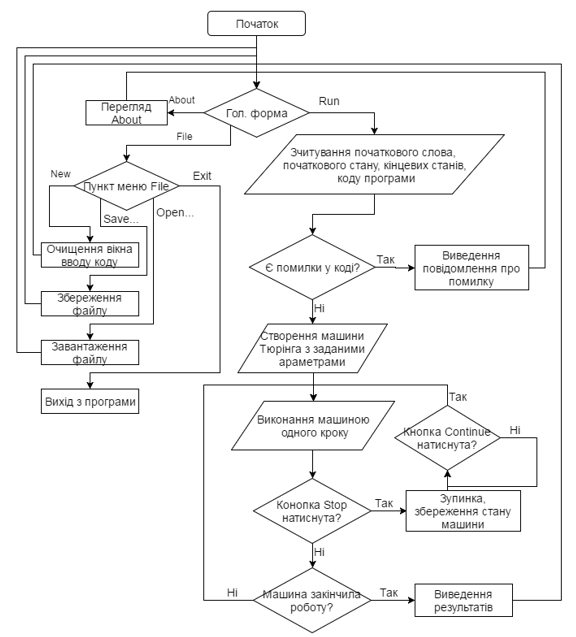
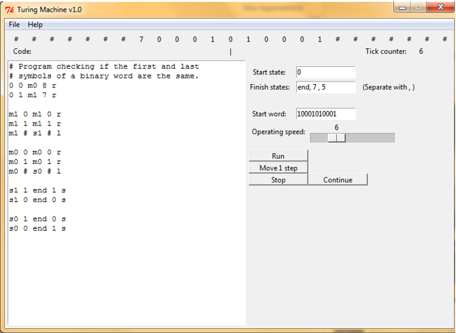

# iasa-python_turing_simulator
My project on the second year of Bachelor's studies. 

## Task:
Build a simulator of Turing machine using Python.
Turing Machine Code can be executed with different speed, adjustable in the UI.
Turing Machine Line is visible in the interface.

This program can execute code from my other project here: https://github.com/PanPip/iasa-turing_machine_topower

TkInter library usedto build interface.

Year -2016

